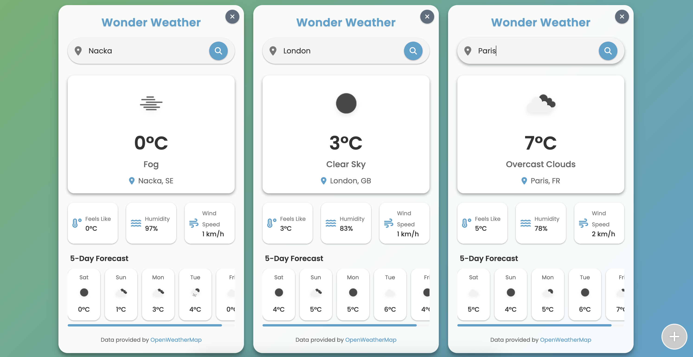

# Wonder Weather

A beautiful, minimalist weather forecast application that displays current weather conditions and a 5-day forecast using the OpenWeatherMap API.

## Try It Now

**[Launch Wonder Weather App](https://bearmug.github.io/wonder-weather/)**

Simply click the link above to run the app directly in your browser from GitHub Pages. No download or installation required!

> **Note:** The app requires a valid OpenWeatherMap API key to function. If you don't have one, the app will guide you through obtaining and entering your key directly in the browser. Your API key will be saved locally as a cookie for future visits.

> Note: If you've cloned or downloaded this repository, you can also open the `index.html` file directly in your browser.

## App Preview

  

## How to Use

1. **View Your Local Weather**: The app automatically detects your location when first loaded (with your permission)
2. **Search Any Location**: Type a city name in the search box and press Enter or click the search button
3. **See Current Conditions**: View temperature, weather description, feels like, humidity, and wind speed
4. **Check 5-Day Forecast**: Scroll horizontally to see weather predictions for the next 5 days

## Features

- Clean, modern UI with Material Design elements
- Current weather conditions display
- 5-day weather forecast
- Location search functionality
- Automatic geolocation detection
- Smooth animations and transitions
- Responsive design for all device sizes

## How It Works

This app uses the OpenWeatherMap API to fetch real-time weather data. It's built as a single HTML file containing all HTML, CSS, and JavaScript code, making it extremely portable and easy to use without any installation or build process.

## Setup Instructions (Only If Link Doesn't Work)

1. **Get an API Key**:
   - Sign up at [OpenWeatherMap](https://openweathermap.org/) to get your free API key
   - Visit your [API keys section](https://home.openweathermap.org/api_keys) after registration
   - It may take a few hours for your new API key to become active after registration

2. **Add Your API Key**:
   - When you first run the app, it will detect if you need an API key
   - Follow the on-screen instructions to enter your API key directly in the browser
   - Your API key will be saved as a cookie for future visits
   - No need to edit any files manually!

3. **Run the Application**:
   - Simply open the `index.html` file in your web browser
   - For the best experience, use a modern browser like Chrome, Firefox, or Edge

## Technologies Used

- HTML5
- CSS3 (with Flexbox for layout)
- JavaScript (ES6+)
- OpenWeatherMap API
- Font Awesome icons
- Google Fonts (Poppins)
- Material Design principles

## Customization

Feel free to customize the app by:
- Changing the background gradient in the CSS file
- Adjusting the color scheme
- Adding additional weather metrics
- Implementing temperature unit conversion (°C/°F)

## License

This project is open source and available under the MIT License.

## Credits

- Weather data provided by [OpenWeatherMap](https://openweathermap.org/)
- Icons from [Font Awesome](https://fontawesome.com/)
- Fonts from [Google Fonts](https://fonts.google.com/) 